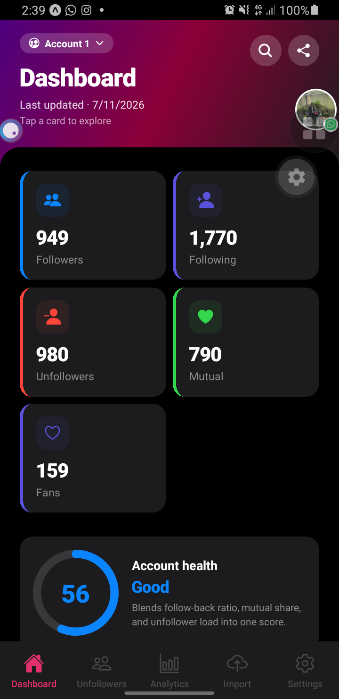
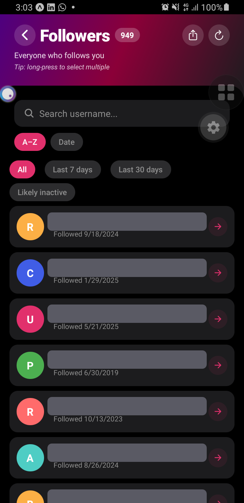
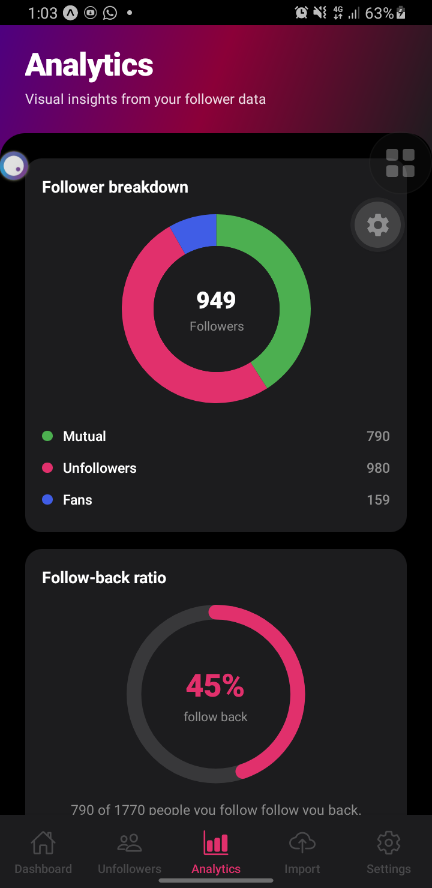
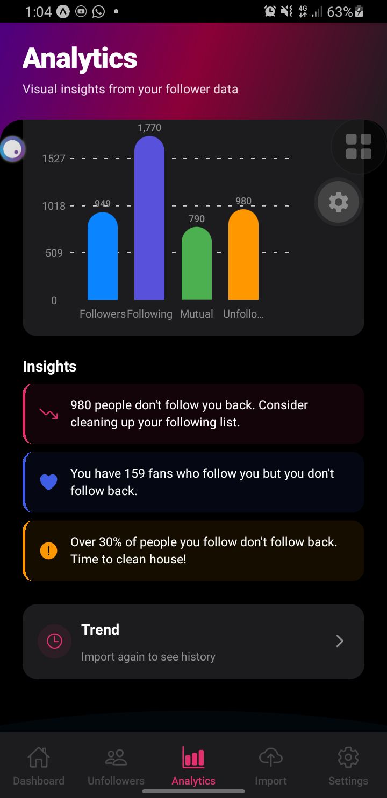
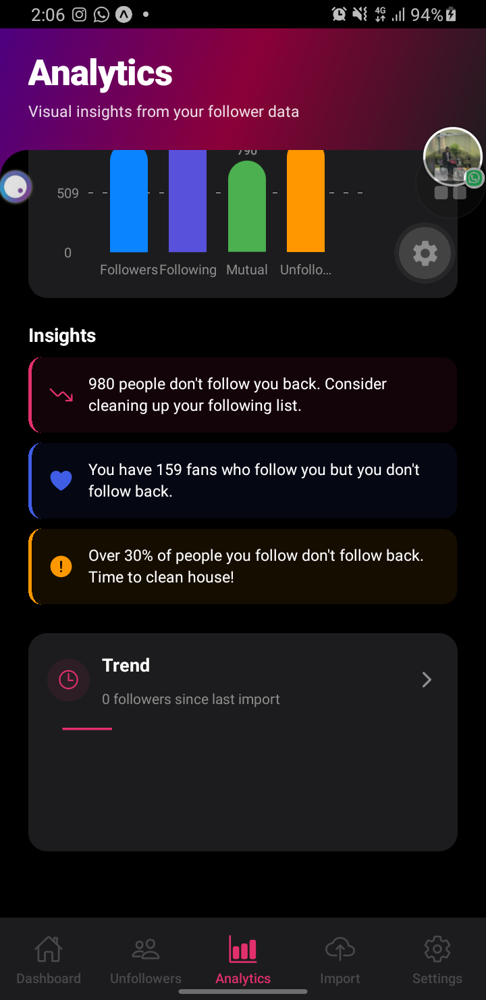
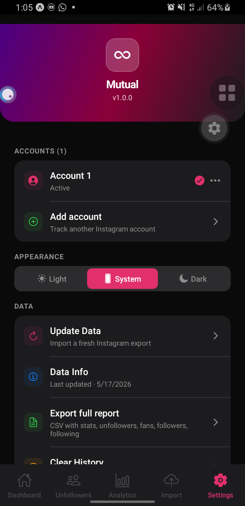
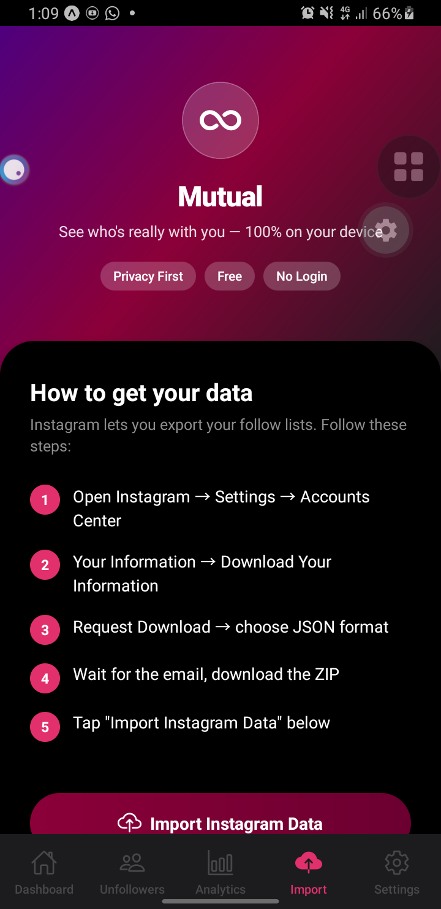

# Mutual

> **See who's really with you on Instagram**
> 100% Free • Open Source • Privacy First


A privacy-first mobile app, built with React Native and Expo, that helps you see who follows you back on Instagram. Mutual reads your Instagram data export on your device — no login, no servers, no tracking.

## Screenshots

<p align="center">
  
  
  
  
  
  
  
</p>

> Usernames in the Followers list are **redacted here for privacy** — the app shows real handles normally on your device. All other screens show aggregate numbers only.

## Features

- **Unfollowers** — people you follow who don't follow back
- **Fans** — people who follow you that you don't follow back
- **Dashboard** — stats grid, follow-back ratio, recent unfollowers
- **Analytics** — donut + ratio ring + bar chart + trend over time
- **History** — every import saved as a snapshot, with deltas vs the previous one
- **Whitelist** — long-press to hide accounts you don't expect to follow back
- **Multiple accounts** — track several Instagram accounts in one app, each with its own data; switch from Settings or the Dashboard chip
- **Share your stats** — export a branded story (9:16) or square (1:1) image of your follower stats — numbers only, never usernames
- **Smart CSV export** — export any list filtered to what's on screen / the last 7 or 30 days / minus likely spam, with plain or privacy-hashed usernames, plus a full-report export
- **Light / dark mode**
- **Backup & restore** your entire app state to a JSON file (optionally passphrase-encrypted)
- **100% private** — no network requests, no analytics, no tracking
- **No login** — never asks for your Instagram credentials

## How it works

1. In Instagram: Settings → Accounts Center → **Your information** → **Download your information**
2. Request a download, choose **JSON** format
3. Wait for Instagram's email (usually minutes to hours)
4. Download the ZIP attached to that email
5. Open Mutual, tap **Import**, select the ZIP
6. Everything is parsed on your device, immediately

## Install

### Android

Download the latest APK from [Releases](https://github.com/NuhaadhHasn/mutual-instagram-tracker/releases) (after the first EAS build), or build your own:

```bash
git clone https://github.com/NuhaadhHasn/mutual-instagram-tracker.git
cd instagram-tracker
npm install
eas login
eas build --platform android --profile preview
```

### iOS

The fastest way to try Mutual on iPhone without paying for an Apple Developer account is via **Expo Go**:

1. Install [Expo Go](https://apps.apple.com/app/expo-go/id982107779) from the App Store
2. Run `npx expo start -c` from the project directory
3. Scan the QR code with your iPhone camera

For a standalone iOS build, an Apple Developer account ($99/year) is required.

## Development

```bash
cd "instagram-tracker"
npm install
npx expo start -c       # clear cache + start Metro
npx tsc --noEmit        # type-check
npm run gen-icons       # regenerate icon PNGs from assets/icon.svg
```

### Project layout

```
instagram-tracker/
├── App.tsx                        # Onboarding gate + navigation
├── app.json                       # Expo config
├── assets/                        # Icons (generated from icon.svg)
├── scripts/gen-icons.js           # SVG → PNG generator (sharp)
└── src/
    ├── features/
    │   ├── dashboard/
    │   ├── unfollowers/
    │   ├── fans/
    │   ├── analytics/
    │   ├── history/
    │   ├── import/
    │   ├── settings/
    │   └── onboarding/
    ├── services/
    │   ├── parsers/instagramParser.ts    # ZIP parsing
    │   └── storage/dataStore.ts          # AsyncStorage wrapper + migration
    └── shared/
        ├── components/                    # SkeletonBox, AnimatedFadeSlide, FreshnessBanner, UserAvatar
        ├── context/                       # ThemeContext, DialogContext
        ├── constants/theme.ts             # Colors, gradients, spacing, shadows, typography
        ├── hooks/                         # useAppInit, useRefreshAppData
        ├── store/appStore.ts              # Zustand store
        ├── types/                         # TypeScript interfaces
        └── utils/haptics.ts               # expo-haptics wrapper
```

### Tech stack

- React Native 0.83 + Expo SDK 55 (Expo Go compatible)
- TypeScript 6 (strict)
- Zustand for global state
- AsyncStorage for local persistence
- React Navigation v7 (root stack + bottom tabs)
- `react-native-gifted-charts` for charts
- `react-native-reanimated` for screen entrance animations
- `expo-haptics`, `expo-file-system`, `expo-document-picker`, `expo-sharing`
- `react-native-view-shot` to capture the shareable stat image
- JSZip for parsing Instagram's ZIP export

## Privacy & security

- All data stays on your device. No servers, no cloud, no telemetry.
- Mutual makes **zero** network requests. (`Linking.openURL` to open a profile in your browser is the only outbound action, and only when you tap.)
- The app never asks for your Instagram password.
- See [PRIVACY_POLICY.md](./PRIVACY_POLICY.md).

## Hard rule

Mutual will never include any feature that risks getting your Instagram account banned: no automated follow/unfollow/block, no scraping, no login, no browser automation, no accessibility-driven taps. The dividing line is **who issues the tap**: a human finger inside Instagram's own UI is safe; anything programmatic is banned territory regardless of pacing.

## Contributing

Issues and pull requests welcome. The code is small enough to read end-to-end in an afternoon.

## License

MIT — see [LICENSE](./LICENSE) if present, or the standard MIT terms apply.

## Disclaimer

Mutual is not affiliated with, endorsed by, or sponsored by Instagram or Meta Platforms, Inc. Instagram is a trademark of Meta Platforms, Inc.
