# Mutual

> **See who's really with you on Instagram**
> 100% Free • Open Source • Privacy First


[](https://github.com/NuhaadhHasn/mutual-instagram-tracker/releases/latest)
[](https://nuhaadhhasn.github.io/mutual-instagram-tracker/try/)

A privacy-first app, built with React Native and Expo, that helps you see who follows you back on Instagram. Mutual reads your Instagram data export on your own device — no login, no accounts, no tracking.

**[Download the Android app](https://github.com/NuhaadhHasn/mutual-instagram-tracker/releases/latest)** · **[Try it in your browser](https://nuhaadhhasn.github.io/mutual-instagram-tracker/try/)** · **[Privacy policy](https://nuhaadhhasn.github.io/mutual-instagram-tracker/privacy-policy.html)**

## Screenshots

### Android

<p align="center">
  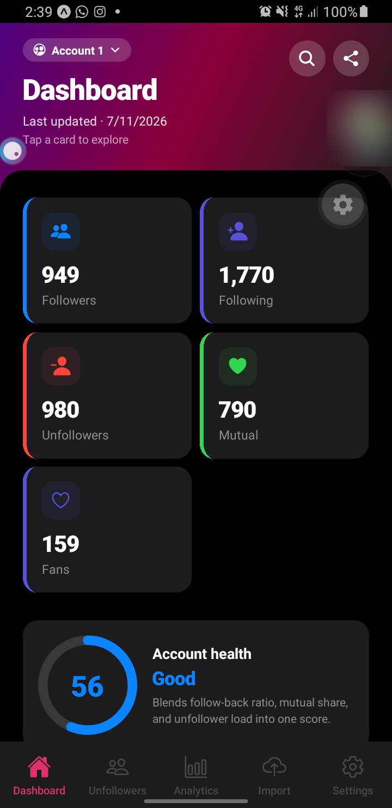
  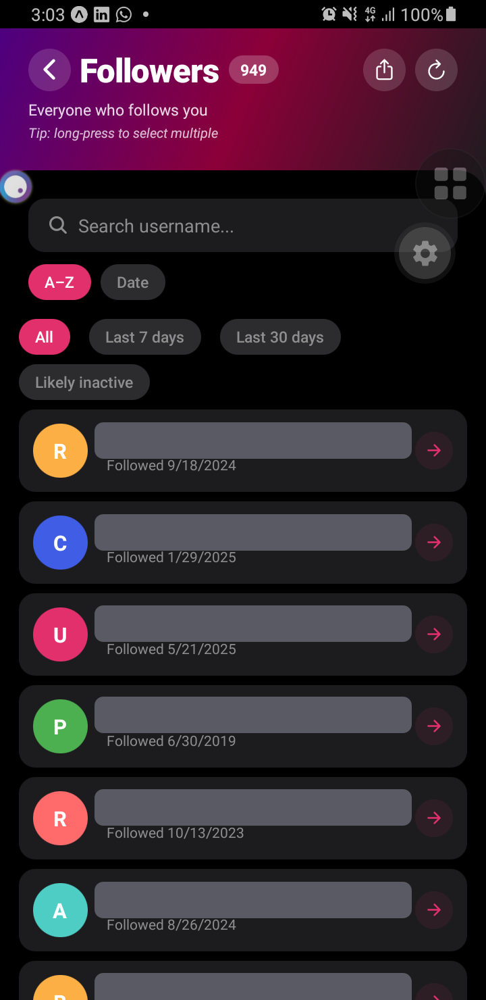
  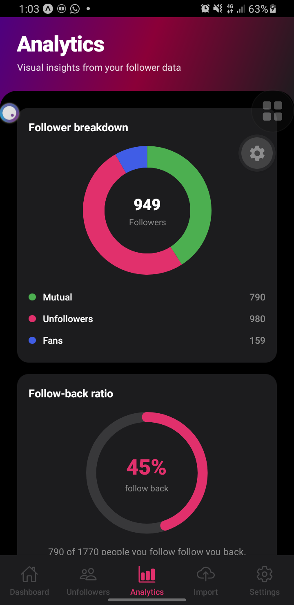
  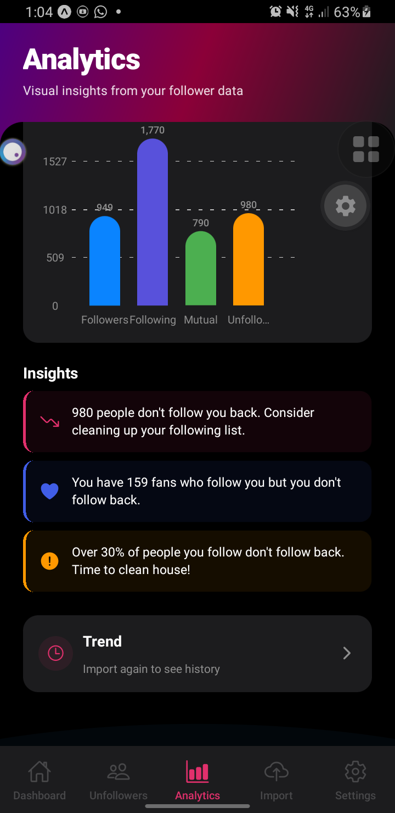
  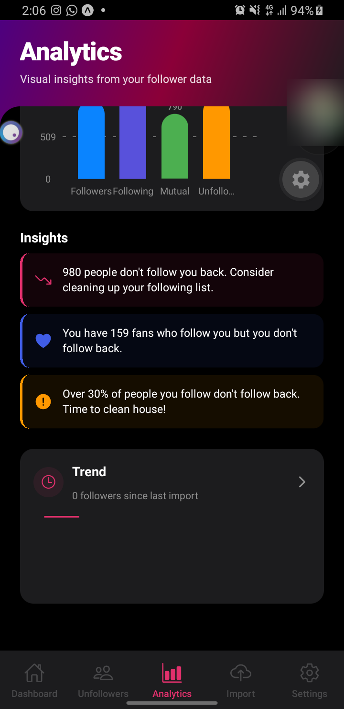
  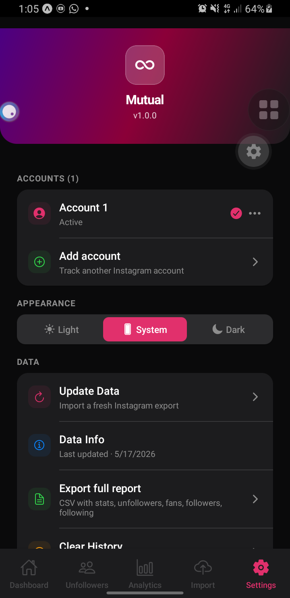
  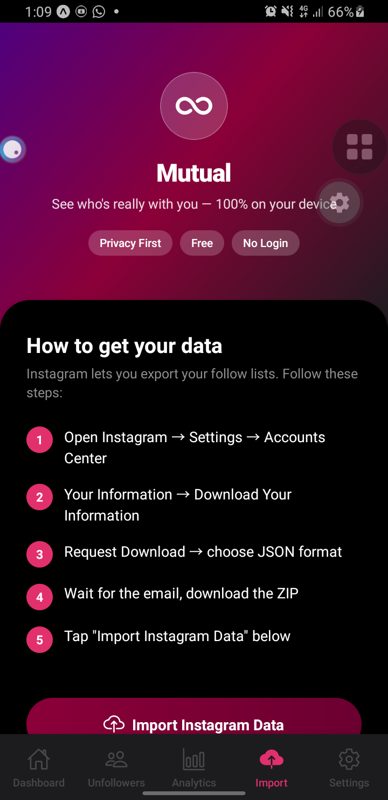
</p>

> Usernames in the Followers list are **redacted here for privacy** — the app shows real handles normally on your device. All other screens show aggregate numbers only.

### Home-screen widget (Android)

<p align="center">
  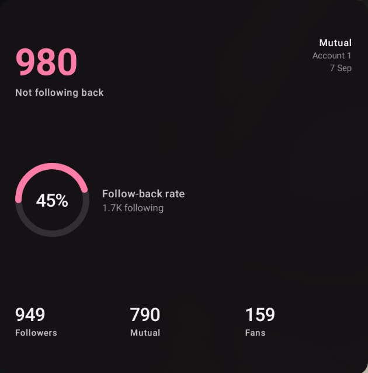
</p>

> Opt-in and off by default. It shows **counts only, never usernames** — a widget stays visible while the app is locked. It resizes: the smallest size is the headline number alone, and each step up adds the account line, the totals row, then the follow-back ring.

### Web

On a desktop browser the bottom tabs become side navigation and the grid widens — the same app, laid out for the screen it's on. Below 900px it falls back to the phone layout.

<p align="center">
  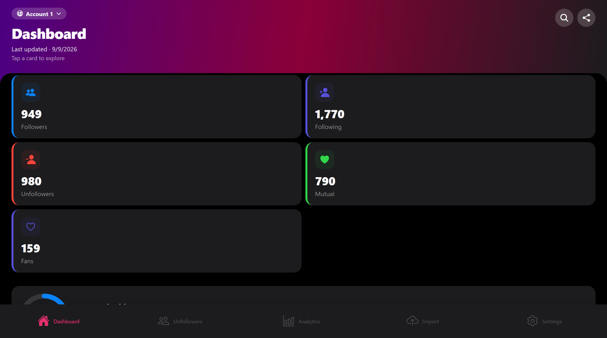
  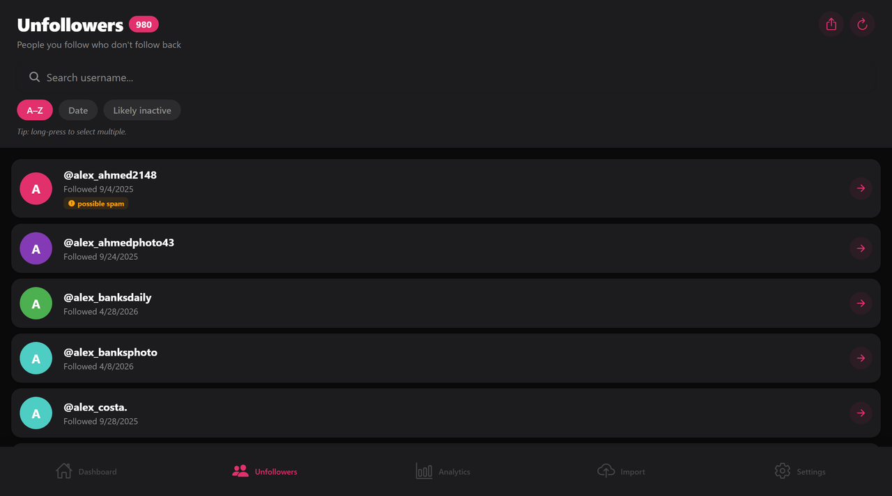
</p>
<p align="center">
  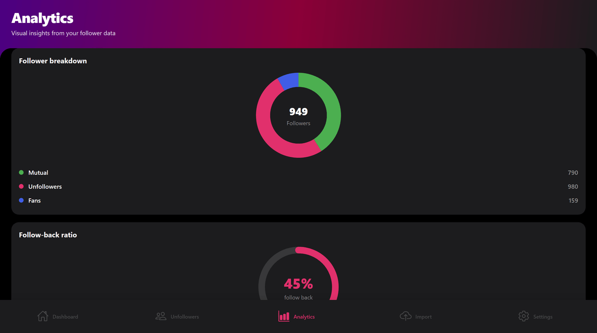
  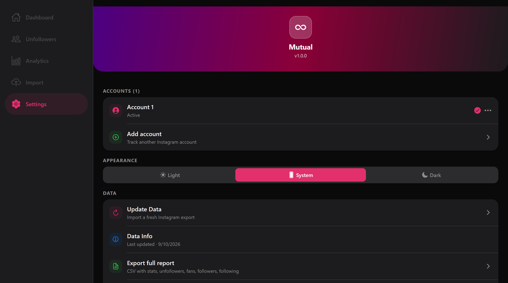
</p>

> The handles in the web screenshots are **generated sample data**, not a real account.

## Features

- **Unfollowers** — people you follow who don't follow back
- **Fans** — people who follow you that you don't follow back
- **Dashboard** — stats grid, follow-back ratio, recent unfollowers
- **Analytics** — donut + ratio ring + bar chart + trend over time
- **History** — every import saved as a snapshot, with deltas vs the previous one
- **Whitelist** — long-press to hide accounts you don't expect to follow back
- **Multiple accounts** — track several Instagram accounts in one app, each with its own data; switch from Settings or the Dashboard chip
- **Share your stats** — export a branded story (9:16) or square (1:1) image of your follower stats — numbers only, never usernames
- **Smart CSV export** — export any list filtered to what's on screen / the last 7 or 30 days / minus likely spam, with plain or privacy-hashed usernames, plus a full-report export
- **Home-screen widget (Android)** — optional and off by default: your counts at a glance on the home screen. Totals only, never usernames. Needs a real build (not Expo Go).
- **Light / dark mode**
- **Backup & restore** your entire app state to a JSON file (optionally passphrase-encrypted)
- **100% private** — no network requests, no analytics, no tracking
- **No login** — never asks for your Instagram credentials

## How it works

1. In Instagram: Settings → Accounts Center → **Your information** → **Download your information**
2. Request a download, choose **JSON** format
3. Wait for Instagram's email (usually minutes to hours)
4. Download the ZIP attached to that email
5. Open Mutual, tap **Import**, select the ZIP
6. Everything is parsed on your device, immediately

## Install

Three ways to run Mutual, in order of completeness.

### Android (the full app)

Download the APK from the [latest release](https://github.com/NuhaadhHasn/mutual-instagram-tracker/releases/latest) and open it on your phone. Android will ask you to allow installing from this source, which is normal for an app distributed outside the Play Store. Requires Android 7.0+.

The release notes carry a SHA-256 so you can verify the download. This build has the `INTERNET` permission stripped from its manifest — it cannot reach the network even if it wanted to.

### In your browser (no install)

**[nuhaadhhasn.github.io/mutual-instagram-tracker/try](https://nuhaadhhasn.github.io/mutual-instagram-tracker/try/)**

The real app, running in your browser. Your ZIP is parsed and stored locally and never uploaded. Loading the page downloads the app from GitHub; after that it works offline, and your browser's install button ("Install this site as an app") gives it its own window.

### On your own machine, nothing hosted

Download `Mutual-1.0.0-web-local.zip` from the [latest release](https://github.com/NuhaadhHasn/mutual-instagram-tracker/releases/latest), unzip, and double-click `run-mutual.cmd` (Windows) or run `./run-mutual.sh` (macOS/Linux). It serves the app at `http://localhost:8321` and opens your browser. Needs Node.js or Python — most machines have one.

Opening `index.html` directly does not work, and that is deliberate: browsers refuse to give `file://` pages a database, so the app could start but never remember your import.

### Build it yourself

```bash
git clone https://github.com/NuhaadhHasn/mutual-instagram-tracker.git
cd mutual-instagram-tracker
npm install

npm run build:web          # → dist/, serve on localhost
eas build --platform android --profile preview   # Android APK (needs `eas login`)
```

### iOS

No iOS build is published. The fastest way to try Mutual on an iPhone is [Expo Go](https://apps.apple.com/app/expo-go/id982107779): run `npx expo start -c` and scan the QR code. A standalone iOS build needs an Apple Developer account ($99/year).

## What differs on web

The browser versions are the same app — same parser, same data model, same screens — minus four things a browser genuinely cannot do. They are **hidden rather than shown doing nothing**, because a privacy control that lies is worse than one that is plainly absent.

| Feature | Android | Web | Why |
|---|:--:|:--:|---|
| Import, all screens, analytics, history, CSV export | ✅ | ✅ | |
| Multiple accounts, whitelist, backup & restore | ✅ | ✅ | |
| App lock (biometric / passcode) | ✅ | — | No biometric prompt in a browser |
| Encryption at rest | ✅ | ✅ | Different mechanisms — see below |
| Screenshot blocking | ✅ | — | No web API exists; a page cannot refuse capture |
| Home-screen widget | ✅ | — | A browser has no home screen |
| Import reminders | ✅ | — | Chrome dropped scheduled notifications; the rest need a push server |

Storage differs underneath too: Android uses AsyncStorage, web uses IndexedDB. Key names are identical, so a backup JSON moves between them unchanged.

**Encryption at rest** works on both, by different means. Android holds a random key in the device Keychain/Keystore and encrypts with AES-256-CBC. The browser has no keystore, so web generates a **non-extractable** AES-256-**GCM** key: it can encrypt and decrypt, but no script — including one injected into the page — can read the key material back out. GCM is authenticated, so on web a single altered byte is rejected outright rather than surfacing as corrupt output.

On web you choose how the key is protected when you switch encryption on. **With a passphrase** (PBKDF2-SHA256,
600k iterations) the browser stores only a wrapped blob — a copy of your browser profile is worthless without the
passphrase, and Mutual asks for it each time you open the app. There is no recovery, by design. **Without one**,
the key is kept in the browser for convenience.

The guarantees are honestly not identical, and it is worth being precise about what the no-passphrase version
buys you. Your data stops being readable text in browser storage, and no page can read the key out — so a script that got into the origin cannot steal the key itself. But the key is kept in the same browser profile as the data, so this is **not** protection against someone who has your computer, or a copy of that profile. Android's key sits in a hardware-backed keystore and is paired with an app lock; web has neither. The in-app dialog says exactly this before you turn it on.

Web also gains something the phone has no room for: at 900px and wider the bottom tab bar becomes a **sidebar**, the dashboard grid goes three across, and the people lists render in two columns. The breakpoint is web-only by design — an Android tablet keeps the phone layout it was built and device-tested for.

## Development

```bash
cd "instagram-tracker"
npm install
npx expo start -c        # clear cache + start Metro
npx tsc --noEmit         # type-check (keep at 0)
npm test                 # unit tests (jest)
npx expo-doctor          # dependency / config validation (keep at 20/20)

npm run build:web        # web build → dist/ (serve on localhost)
npm run build:web:hosted # web build → docs/try/ (GitHub Pages subpath)
npm run gen-icons        # regenerate icon PNGs from assets/icon.svg
```

`build:web:hosted` exists because `expo export` bakes absolute asset paths into the
bundle, which 404 under a Pages subpath. It sets `experiments.baseUrl` for the duration
of that one build and restores `app.json` afterwards, so the local build stays
root-relative.

### Project layout

```
instagram-tracker/
├── App.tsx                        # Onboarding gate + navigation
├── app.json                       # Expo config
├── assets/                        # Icons (generated from icon.svg)
├── scripts/gen-icons.js           # SVG → PNG generator (sharp)
└── src/
    ├── features/
    │   ├── dashboard/
    │   ├── unfollowers/
    │   ├── fans/
    │   ├── analytics/
    │   ├── history/
    │   ├── import/
    │   ├── settings/
    │   ├── search/
    │   ├── onboarding/
    │   └── widget/                # Android home-screen widget UI
    ├── services/
    │   ├── parsers/
    │   │   ├── instagramParser.ts        # ZIP parsing
    │   │   ├── pickZip.ts                # native: pick file → base64
    │   │   └── pickZip.web.ts            # web: pick file → Blob straight to JSZip
    │   └── storage/
    │       ├── dataStore.ts              # storage wrapper + migration
    │       ├── kv.ts                     # native storage → AsyncStorage
    │       └── kv.web.ts                 # web storage → IndexedDB (idb-keyval)
    └── shared/
        ├── components/                    # SkeletonBox, AnimatedFadeSlide, FreshnessBanner, UserAvatar
        ├── context/                       # ThemeContext, DialogContext
        ├── constants/theme.ts             # Colors, gradients, spacing, shadows, typography
        ├── hooks/                         # useAppInit, useRefreshAppData
        ├── store/appStore.ts              # Zustand store
        ├── types/                         # TypeScript interfaces
        └── utils/haptics.ts               # expo-haptics wrapper
```

### Tech stack

- React Native 0.83 + Expo SDK 55 (Expo Go compatible)
- `react-native-web` for the browser build — one codebase, `.web.ts` splits where platforms genuinely differ
- TypeScript 6 (strict)
- Zustand for global state
- AsyncStorage (native) / IndexedDB via `idb-keyval` (web) behind a shared four-method storage facade
- React Navigation v7 (root stack + bottom tabs)
- `react-native-gifted-charts` for charts
- `react-native-reanimated` for screen entrance animations
- `expo-haptics`, `expo-file-system`, `expo-document-picker`, `expo-sharing`
- `react-native-view-shot` to capture the shareable stat image
- `react-native-android-widget` for the optional Android home-screen widget (config plugin — no Kotlin, still a managed Expo project)
- JSZip for parsing Instagram's ZIP export

## Privacy & security

- All data stays on your device. No servers, no cloud, no telemetry, no accounts.
- The Android app makes **zero** network requests — the `INTERNET` permission is stripped from its manifest, so it cannot reach the network at all. (`Linking.openURL` to open a profile is the only outbound action, and only when you tap.)
- The **hosted web demo** is one honest exception: loading the page downloads the app from GitHub Pages, and GitHub logs that request like any website would. Once loaded it behaves identically — your export is parsed and stored in your own browser, nothing is uploaded, and it keeps working offline. Run the local build instead if you'd rather not touch a server at all.
- The app never asks for your Instagram password.
- See [PRIVACY_POLICY.md](./PRIVACY_POLICY.md).

## Hard rule

Mutual will never include any feature that risks getting your Instagram account banned: no automated follow/unfollow/block, no scraping, no login, no browser automation, no accessibility-driven taps. The dividing line is **who issues the tap**: a human finger inside Instagram's own UI is safe; anything programmatic is banned territory regardless of pacing.

## Contributing

Issues and pull requests welcome. The code is small enough to read end-to-end in an afternoon.

## License

MIT — see [LICENSE](./LICENSE) if present, or the standard MIT terms apply.

## Disclaimer

Mutual is not affiliated with, endorsed by, or sponsored by Instagram or Meta Platforms, Inc. Instagram is a trademark of Meta Platforms, Inc.
